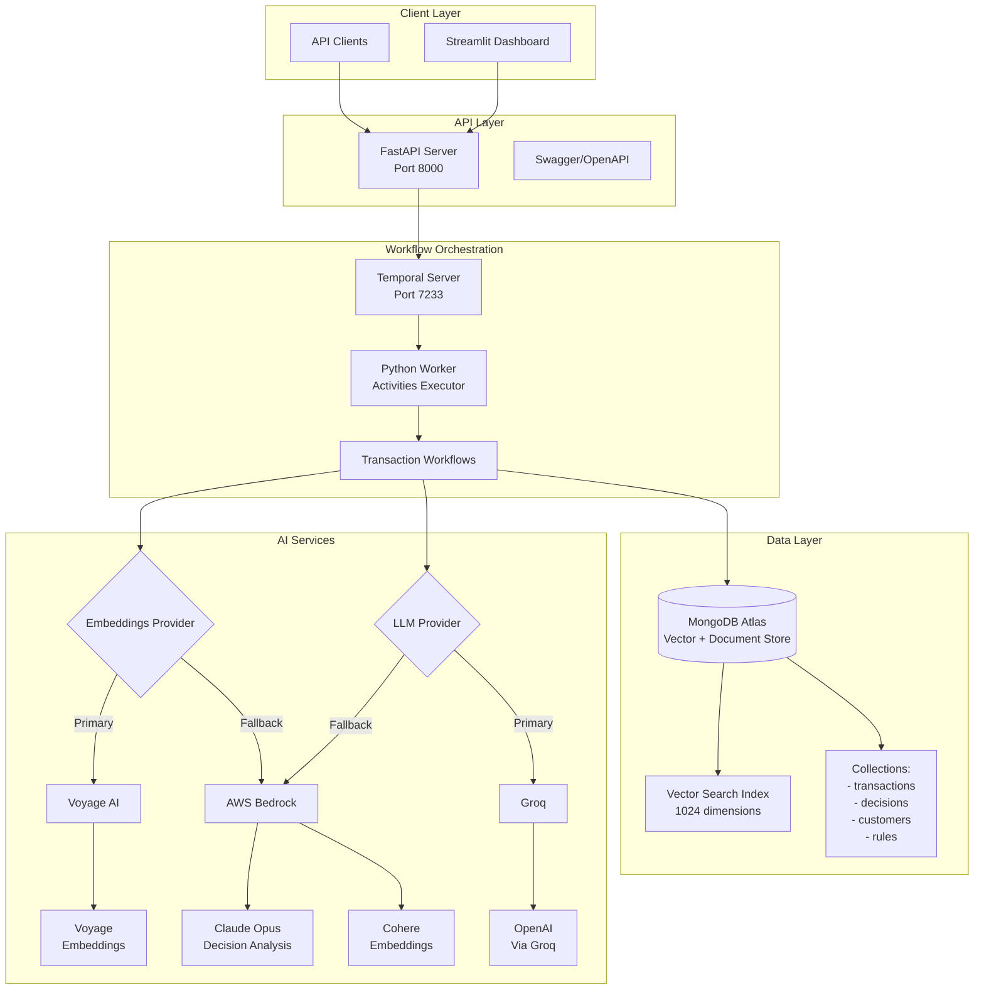
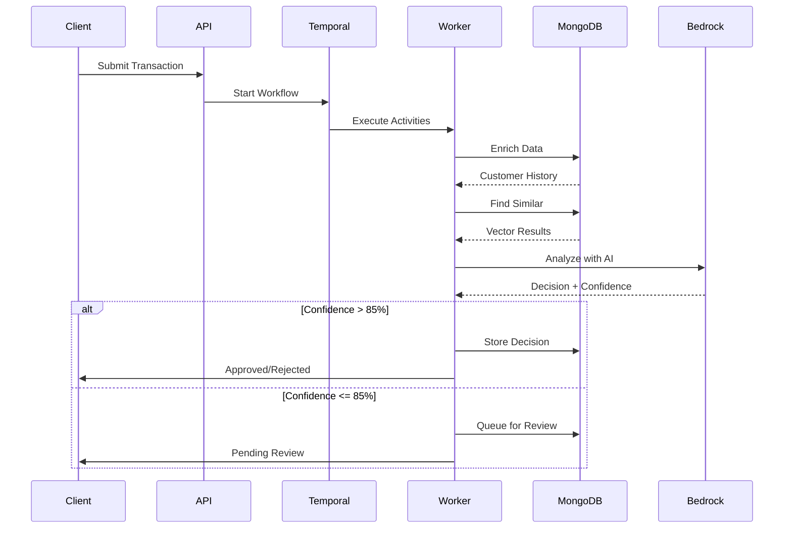
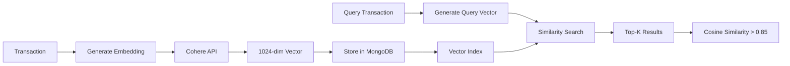
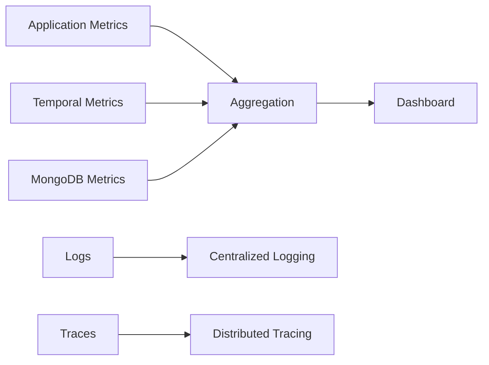

# Architecture Documentation

## System Overview

The AI-Powered Transaction Processing System is built on a microservices architecture that combines best-in-class technologies for scalable, reliable financial transaction processing. This document details the technical architecture, data flows, and integration patterns used in the PoV implementation.

## Core Architecture Diagram



## Component Architecture

### 1. API Layer (FastAPI)

**Location:** `api/main.py`

**Responsibilities:**
- REST endpoint exposure
- Request validation
- Workflow initiation
- Health monitoring

**Key Endpoints:**
```
POST /api/transactions          - Submit new transaction
GET  /api/transactions/{id}     - Get transaction status
GET  /api/workflows             - List workflow executions
POST /api/reviews/{id}/decision - Submit human review decision
GET  /health                    - Service health check
```

### 2. Workflow Orchestration (Temporal)

**Location:** `temporal/workflows.py`, `temporal/activities.py`

**Workflow Definition:**
```python
class TransactionProcessingWorkflow:
    Activities:
    1. enrich_transaction_data()
    2. perform_transaction_risk_assessment()
    3. find_similar_transactions()
    4. analyze_transaction_with_ai()
    5. store_decision() OR queue_for_human_review()
    6. send_notification()
```

**Temporal Features Used:**
- **Durable Execution:** Survives process crashes
- **Retry Policies:** Exponential backoff with jitter
- **Signals:** Manager approval, decision override
- **Queries:** Workflow status retrieval
- **Timeouts:** Activity-level and workflow-level

### 3. Data Layer (MongoDB Atlas)

**Database Schema:**

```javascript
// transactions collection
{
  _id: ObjectId,
  transaction_id: String,
  amount: Number,
  currency: String,
  type: String,
  source_account: String,
  destination_account: String,
  timestamp: Date,
  embedding: Array[1024], // Vector for similarity search
  workflow_id: String,
  status: String,
  risk_score: Number
}

// transaction_decisions collection
{
  _id: ObjectId,
  transaction_id: String,
  decision: String,
  confidence: Number,
  reasoning: String,
  risk_factors: Array,
  similar_transactions: Array,
  decided_at: Date,
  decided_by: String
}

// rules collection
{
  _id: ObjectId,
  name: String,
  condition: Object,
  action: String,
  priority: Number,
  enabled: Boolean,
  effectiveness: {
    true_positives: Number,
    false_positives: Number
  }
}
```

**Indexes:**
- `transaction_id` (unique)
- `timestamp` (descending)
- `source_account + timestamp` (compound)
- `embedding` (vector search index)
- `workflow_id` (for Temporal integration)

### 4. AI Integration Layer

**AWS Bedrock Configuration:**

```python
# ai/bedrock_client.py
Models:
- Claude Opus: Transaction analysis and decision making
- Cohere: Embedding generation (1024 dimensions)

Features:
- Structured prompts with transaction context
- Confidence scoring (0-100)
- Detailed reasoning output
- Mock fallback for demo mode
```

## Data Flow Architecture

### Transaction Processing Flow



### Vector Search Pipeline



## Integration Patterns

### 1. Temporal Workflow Pattern

**Compensation & Rollback:**
```python
try:
    # Main transaction processing
    result = await process_transaction()
except Exception as e:
    # Compensation logic
    await reverse_fund_hold()
    await notify_failure()
    raise
```

**Retry Configuration:**
```python
retry_policy = RetryPolicy(
    initial_interval=timedelta(seconds=1),
    backoff_coefficient=2.0,
    maximum_interval=timedelta(seconds=60),
    maximum_attempts=5
)
```

### 2. MongoDB Aggregation Pipelines

**Fraud Network Detection:**
```javascript
db.transactions.aggregate([
  { $match: { account_id: targetAccount } },
  { $graphLookup: {
      from: "transactions",
      startWith: "$destination_account",
      connectFromField: "destination_account",
      connectToField: "source_account",
      as: "network",
      maxDepth: 3
  }},
  { $unwind: "$network" },
  { $group: {
      _id: "$network.destination_account",
      total_amount: { $sum: "$network.amount" },
      transaction_count: { $count: {} }
  }}
])
```

### 3. AI Prompt Engineering

**Structured Analysis Template:**
```python
prompt = f"""
Analyze this financial transaction for fraud risk:

Transaction Details:
- Amount: ${amount}
- Type: {transaction_type}
- Source: {source_account}
- Destination: {destination_account}

Context:
- Customer History: {history_summary}
- Similar Transactions: {similar_txns}
- Risk Indicators: {risk_flags}

Provide:
1. Decision (APPROVE/REJECT/REVIEW)
2. Confidence (0-100)
3. Reasoning (detailed explanation)
"""
```

## Scalability Considerations

### Current PoV Limitations

| Component | PoV Scope | Production Considerations |
|-----------|-----------|---------------------------|
| API Throughput | Basic load handling | Would require load balancing |
| Workflow Concurrency | Limited concurrent workflows | Would need worker scaling |
| MongoDB Connections | Default connection pool | Would need connection optimization |
| Vector Search | Basic indexing | Would need index optimization |
| AI Inference | Synchronous calls | Would benefit from batching |

### Production Scaling Strategy

1. **Horizontal Scaling:**
   - Deploy API servers behind load balancer
   - Multiple Temporal workers with partitioning
   - MongoDB Atlas auto-scaling clusters

2. **Caching Layer:**
   - Use a Caching layer for customer profile caching
   - Embedding cache for frequent queries
   - Decision cache for idempotency

3. **Performance Optimizations:**
   - Batch embedding generation
   - Async AI inference with queuing
   - Connection pooling for all services

## Security Architecture

### Authentication & Authorization

```
Client --> API Gateway --> JWT Validation --> Service
                |
                v
           Rate Limiting
                |
                v
            API Server
```

### Data Protection

- **Encryption at Rest:** MongoDB Atlas encryption
- **Encryption in Transit:** TLS 1.3 for all connections
- **Secrets Management:** Environment variables (PoV), AWS Secrets Manager (Production)
- **PII Handling:** Field-level encryption for sensitive data

## Monitoring & Observability

### Metrics Collection



### Key Performance Indicators

- **Transaction Processing Time:** P50, P95, P99
- **Decision Accuracy:** True/False Positive Rates
- **System Availability:** Uptime percentage
- **Queue Depth:** Human review backlog
- **Cost Metrics:** Per-transaction processing cost

## Deployment Architecture

### Docker Compose (PoV)

```yaml
services:
  temporal:
    image: temporalio/auto-setup
    ports: ["7233:7233", "8080:8080"]

  api:
    build: ./api
    depends_on: [temporal]
    ports: ["8000:8000"]

  worker:
    build: ./temporal
    depends_on: [temporal, api]

  dashboard:
    build: ./dashboard
    ports: ["8505:8505"]
```

### Kubernetes (Production)

```yaml
Deployments:
- api-deployment (3 replicas)
- worker-deployment (5 replicas)
- dashboard-deployment (2 replicas)

Services:
- api-service (LoadBalancer)
- temporal-service (ClusterIP)
- dashboard-service (LoadBalancer)

ConfigMaps:
- app-config
- temporal-config

Secrets:
- mongodb-credentials
- aws-credentials
```

## Technology Stack Summary

| Layer | Technology | Version | Purpose |
|-------|------------|---------|---------|
| API | FastAPI | 0.104+ | REST API framework |
| Workflow | Temporal | 1.22+ | Durable execution |
| Database | MongoDB Atlas | 7.0+ | Document store + vectors |
| AI/ML | AWS Bedrock | Latest | Claude & Cohere models |
| UI | Streamlit | 1.28+ | Dashboard interface |
| Container | Docker | 24+ | Containerization |
| Language | Python | 3.11+ | Primary language |

## API Contracts

### Transaction Submission

**Request:**
```json
POST /api/transactions
{
  "transaction_id": "TXN-123",
  "amount": 5000.00,
  "currency": "USD",
  "type": "wire_transfer",
  "source_account": "ACC-001",
  "destination_account": "ACC-002",
  "description": "Invoice payment",
  "metadata": {
    "ip_address": "192.168.1.1",
    "device_id": "device-123"
  }
}
```

**Response:**
```json
{
  "workflow_id": "wf-abc-123",
  "status": "processing",
  "estimated_completion": "2024-01-01T12:00:00Z"
}
```

### Workflow Status Query

**Request:**
```
GET /api/workflows/{workflow_id}/status
```

**Response:**
```json
{
  "workflow_id": "wf-abc-123",
  "status": "completed",
  "decision": "approved",
  "confidence": 92.5,
  "reasoning": "Low risk transaction with verified customer",
  "completed_at": "2024-01-01T12:00:05Z"
}
```

## Database Optimization

### Index Strategy

1. **Single Field Indexes:**
   - `transaction_id` - Primary lookup
   - `timestamp` - Time-based queries
   - `workflow_id` - Temporal integration

2. **Compound Indexes:**
   - `{source_account: 1, timestamp: -1}` - Account history
   - `{status: 1, timestamp: -1}` - Queue management

3. **Vector Search Index:**
   ```javascript
   {
     "mappings": {
       "fields": {
         "embedding": {
           "type": "knnVector",
           "dimensions": 1024,
           "similarity": "cosine"
         }
       }
     }
   }
   ```

## Error Handling Strategy

### Activity-Level Errors

```python
@activity.defn
async def process_transaction(input: TransactionInput) -> TransactionResult:
    try:
        # Main processing logic
        return result
    except Exception as e:
        # Retriable errors (network, timeout)
        raise ApplicationError(str(e), non_retryable=False)
```

### Workflow-Level Compensation

```python
async def execute_with_compensation(ctx):
    try:
        result = await ctx.execute_activity(process_payment)
        return result
    except Exception as e:
        # Compensation logic
        await ctx.execute_activity(reverse_payment)
        await ctx.execute_activity(notify_failure)
        raise
```

## Performance Benchmarks

### PoV Performance Characteristics

| Operation | Description | Notes |
|-----------|-------------|-------|
| API Request | REST endpoint processing | FastAPI async handling |
| Workflow Execution | End-to-end transaction processing | Includes all activities |
| Vector Search | Similarity matching | 1024-dimensional vectors |
| AI Analysis | Bedrock API calls | Claude and Cohere models |
| MongoDB Operations | CRUD operations | Using connection pooling |

## Conclusion

This architecture provides a robust foundation for a production-ready transaction processing system. The combination of Temporal's reliability, MongoDB's flexibility, and AI-powered decision making creates a system that can scale to meet enterprise demands while maintaining high accuracy and compliance standards.

The PoV implementation demonstrates all critical capabilities while clearly identifying areas for production hardening and optimization.